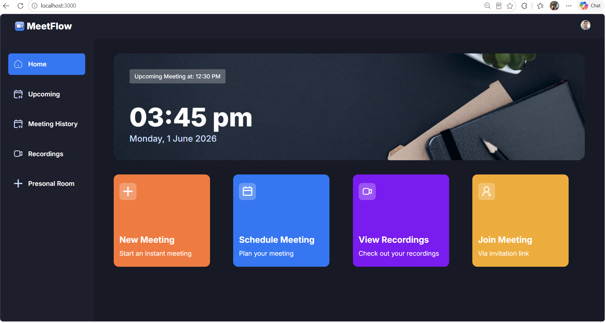
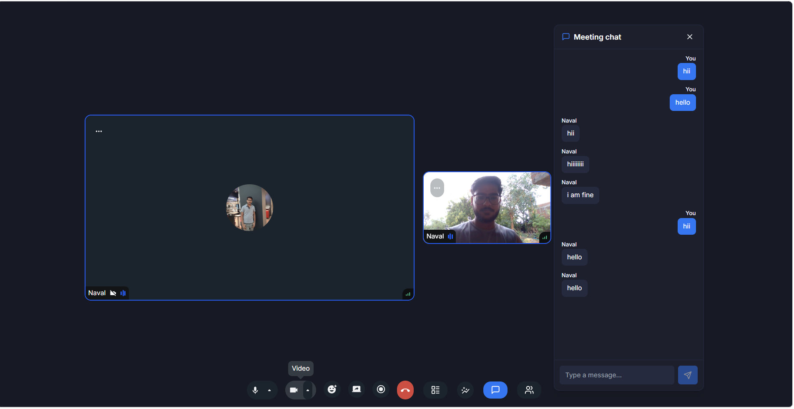
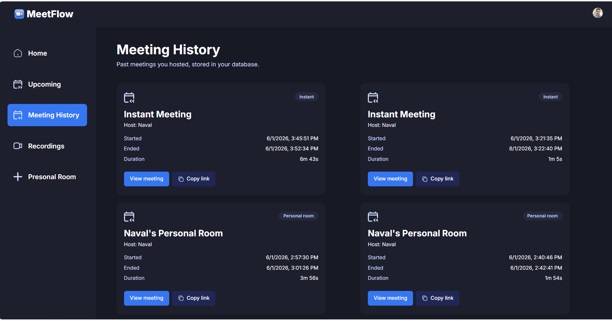
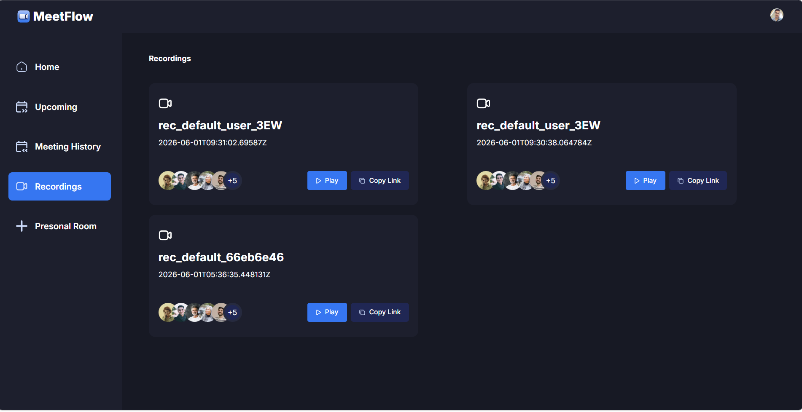

# MeetFlow 🚀

A modern video conferencing platform built with **Next.js**, **TypeScript**, **Clerk**, **Stream Video/Chat**, and **MongoDB Atlas**.

MeetFlow enables users to create instant meetings, schedule future meetings, join via invitation links, chat in real time, share screens, access meeting history, and view recorded sessions — all through a clean and responsive user interface.

---

## 🔗 Live Demo

**Live Application:** https://meetflow.vercel.app

---

## 📸 Screenshots

### Dashboard



### Meeting Room & Real-Time Chat



### Meeting History



### Recordings



---

## ✨ Features

### 🎥 Video Conferencing

* High-quality video and audio calls
* Personal meeting rooms
* Join meetings via shareable links
* Participant management

### 💬 Real-Time Chat

* Live meeting chat powered by Stream Chat
* Instant message synchronization
* Persistent chat history

### 📅 Meeting Scheduling

* Schedule meetings for future dates
* Upcoming meetings dashboard
* Easy invitation sharing

### 📜 Meeting History

* Track previously attended meetings
* Quick access to past sessions

### 🎬 Recordings

* View and manage recorded meetings
* Replay important discussions anytime

### 🖥️ Screen Sharing

* Share your screen during meetings
* Improve collaboration and presentations

### 🔐 Authentication & Security

* Secure authentication using Clerk
* Protected routes and session management

---

## 🎯 Highlights

* Real-time video conferencing using Stream Video SDK
* Live meeting chat with persistent message storage
* Meeting scheduling and history tracking
* Meeting recordings and screen sharing
* Secure user authentication and authorization
* MongoDB Atlas integration for data persistence
* Fully responsive UI built with Tailwind CSS
* Production-ready deployment architecture

---

## 🛠️ Tech Stack

| Technology       | Purpose                            |
| ---------------- | ---------------------------------- |
| Next.js 14       | Frontend & Backend Framework       |
| TypeScript       | Type Safety                        |
| Tailwind CSS     | UI Styling                         |
| Clerk            | Authentication                     |
| Stream Video SDK | Video Calling                      |
| Stream Chat SDK  | Real-Time Chat                     |
| MongoDB Atlas    | Meeting History & Data Persistence |
| Vercel           | Deployment                         |

---

## 🏗️ System Architecture

```text
User
  ↓
Clerk Authentication
  ↓
MeetFlow Application (Next.js)
  ↓
Stream Video & Chat Services
  ↓
MongoDB Atlas Storage
```

### Application Flow

1. User signs in using Clerk Authentication.
2. User creates, schedules, or joins a meeting.
3. Stream Video manages video/audio communication.
4. Stream Chat handles real-time messaging.
5. MongoDB stores meeting history and chat-related data.
6. Users can access recordings and previous meeting information.

---

## 📂 Project Structure

```bash
app/
components/
actions/
hooks/
lib/
providers/
constants/
public/
images/
```

---

## ⚙️ Environment Variables

Create a `.env.local` file in the root directory:

```env
NEXT_PUBLIC_CLERK_PUBLISHABLE_KEY=
CLERK_SECRET_KEY=

NEXT_PUBLIC_STREAM_API_KEY=
STREAM_SECRET_KEY=

NEXT_PUBLIC_BASE_URL=http://localhost:3000

MONGODB_URI=
```

---

## 🚀 Getting Started

Clone the repository:

```bash
git clone https://github.com/navalmishra/meetflow.git
cd meetflow
```

Install dependencies:

```bash
npm install
```

Run the development server:

```bash
npm run dev
```

Open:

```text
http://localhost:3000
```

---

## 🌐 Deployment

MeetFlow is optimized for deployment on Vercel.

Build the application:

```bash
npm run build
```

Deploy by importing the GitHub repository into Vercel and configuring the required environment variables.

---

## 🚀 Future Enhancements

* AI Meeting Summaries
* AI-Generated Meeting Notes
* Meeting Transcripts
* Virtual Backgrounds
* File Sharing During Meetings
* Meeting Analytics Dashboard
* Meeting Insights & Productivity Metrics

---

## 👨‍💻 Author

### Naval Chandra Mishra

Built as a full-stack video conferencing platform showcasing:

* Real-time communication
* Authentication & Authorization
* Database Integration
* Scalable Web Application Architecture
* Modern Full-Stack Development Practices

---

